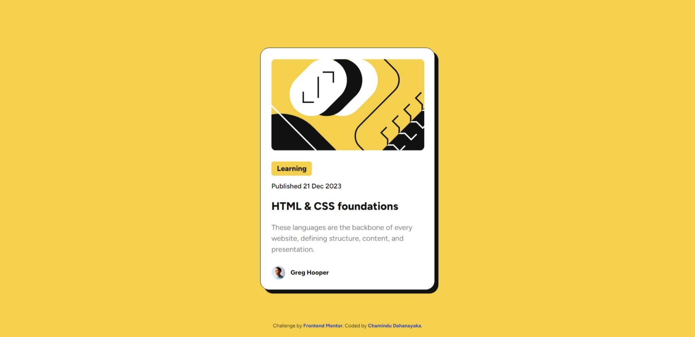

# Frontend Mentor - Blog preview card solution

This is a solution to the [Blog preview card challenge on Frontend Mentor](https://www.frontendmentor.io/challenges/blog-preview-card-ckPaj01IcS). Frontend Mentor challenges help you improve your coding skills by building realistic projects. 

## Table of contents

- [Overview](#overview)
  - [The challenge](#the-challenge)
  - [Screenshot](#screenshot)
  - [Links](#links)
- [My process](#my-process)
  - [Built with](#built-with)
  - [What I learned](#what-i-learned)
  - [Continued development](#continued-development)
- [Author](#author)

## Overview

### The challenge

Users should be able to:

- See hover and focus states for all interactive elements on the page

### Screenshot



### Links

- Solution URL: [Solution URL here](https://www.frontendmentor.io/solutions/blog-preview-card-r5_QXBTOgS)
- Live Site URL: [Live site URL here](https://chamindud.github.io/blog-preview-card/)

## My process

### Built with

- Semantic HTML5 markup
- Flexbox

### What I learned

In this project, I learned to use below code snippets:

```css
@font-face {
  font-family: 'Figtree';
  src: url('assets/fonts/Figtree-VariableFont_wght.ttf') format('truetype');
  font-style: normal;
}
```

### Continued development

I'm looking to improve my CSS knowledge to design more unique and new stuff.

## Author

- Frontend Mentor - [@ChaminduD](https://www.frontendmentor.io/profile/ChaminduD)
- LinkedIn - [Chamindu Dahanayaka](https://www.linkedin.com/in/chamindudahanayaka/)